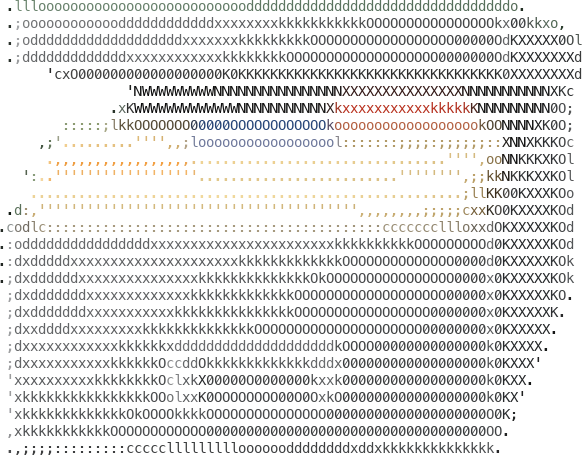
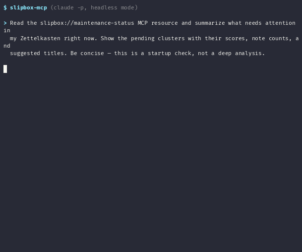
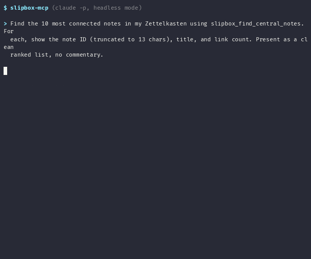
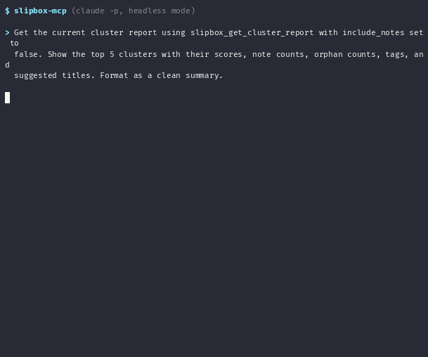
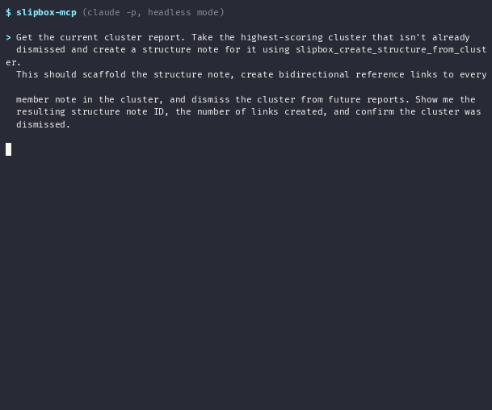
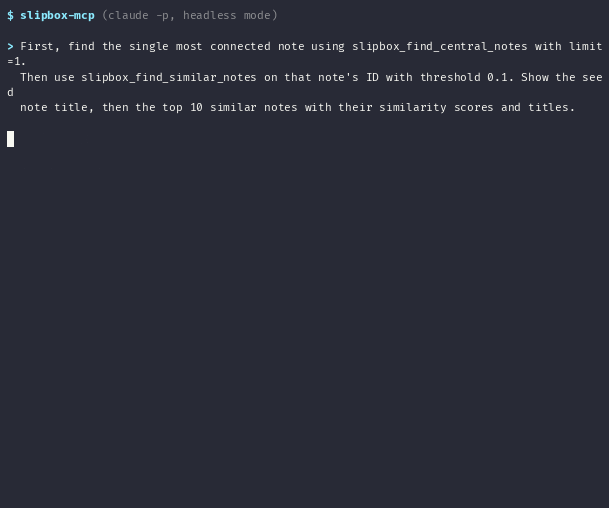
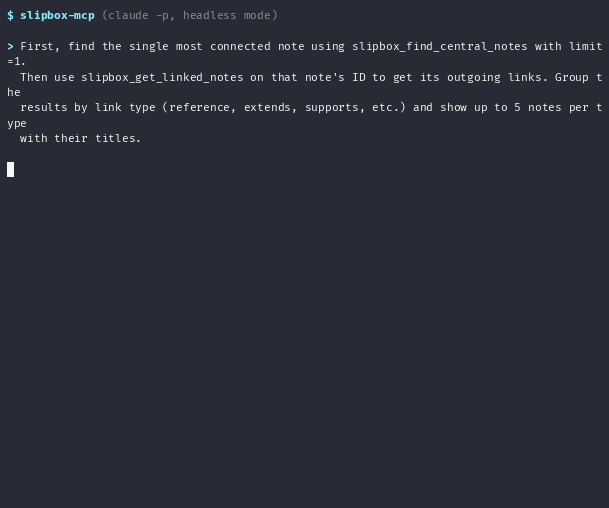
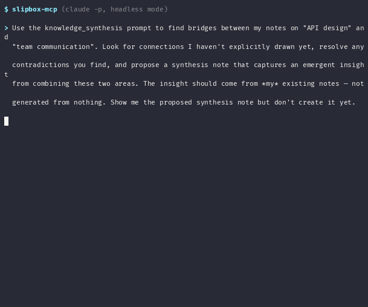
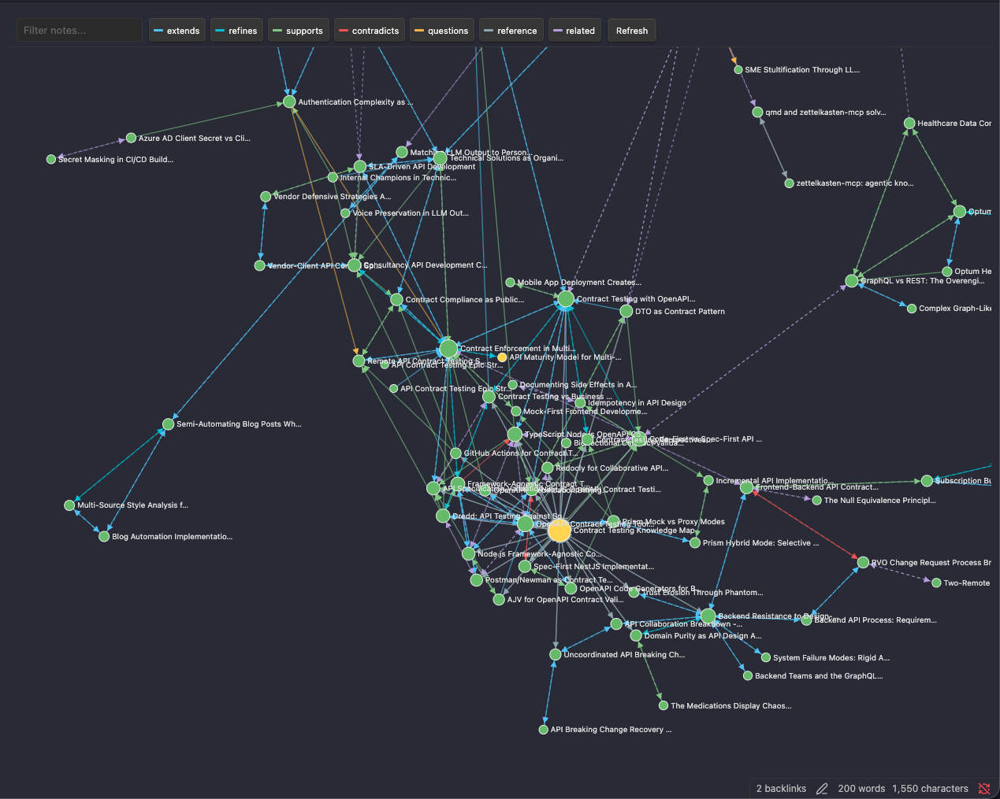
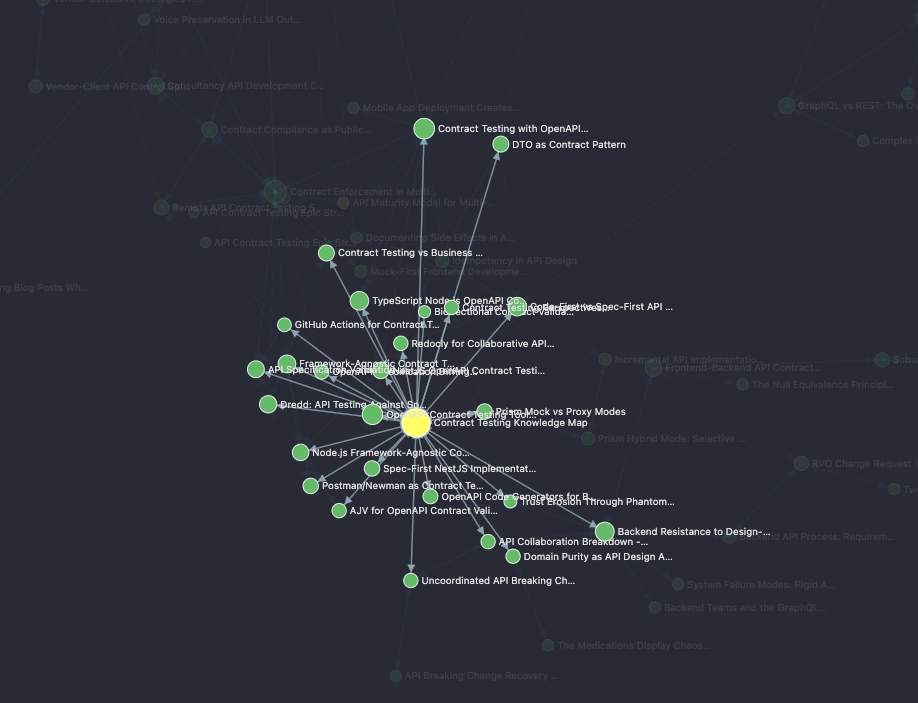

# Slipbox MCP Server



Give your AI assistant an active role in managing your knowledge. Slipbox is an [MCP server](https://modelcontextprotocol.io/) that turns any MCP-compatible agent into a Zettelkasten partner -- creating atomic notes, forming semantic links, detecting emergent clusters, and synthesizing insights from your existing knowledge.

Your ideas in, structured knowledge out. The agent handles the formatting, linking, and integration.

New to the method? Start with [*Introduction to the Zettelkasten Method*](https://zettelkasten.de/introduction/) for the why behind atomic notes and linked thinking.

Built and tested with Claude. Works with any MCP client (Claude Desktop, Claude Code, OpenCode, Copilot, or anything that speaks MCP).

**Plain files, zero lock-in.** Notes are markdown with YAML frontmatter -- readable in Obsidian, Foam, Logseq, or any editor. The SQLite database is an index, not the source of truth. Delete it and rebuild from files anytime.

- **19 MCP tools** for notes, links, search, graph analysis, and cluster management
- **6 workflow prompts** (plus matching skills) encoding the Zettelkasten method so you don't re-learn it every session
- **BM25 full-text search** across titles and content via SQLite FTS5
- **Cluster detection** finds emergent topic groups and scaffolds structure notes
- **Seven typed links** (reference, extends, refines, contradicts, questions, supports, related)

Python 3.10+ | macOS or Linux

## In Action

### Proactive Maintenance

The agent reads the `slipbox://maintenance-status` resource at session start and surfaces clusters that need organizing.



### Full-Text Search

BM25-ranked search across notes via `zk_search_notes`.


### Knowledge Graph: Central Notes

`zk_find_central_notes` surfaces the structural anchors of the graph -- the notes everything else orbits.



### Direct Idea Capture

Your raw thinking in, a formatted atomic note with tags and links out. The agent formats and integrates -- the ideas stay yours.


### Note Analysis

The `analyze_note` prompt evaluates atomicity, finds real connections in the existing graph, suggests tags, and rewrites for clarity.


### Source Decomposition

The `knowledge_creation` prompt splits an article into atomic literature notes with proper citation and links.


### Cluster Detection

`zk_get_cluster_report` finds groups of co-occurring tags that lack a structure note. Scored by size, orphan ratio, link density, and recency.



### Structure Note Creation

`zk_create_structure_from_cluster` scaffolds a structure note, links all member notes, and dismisses the cluster.



### Orphaned Notes

`zk_find_orphaned_notes` surfaces unintegrated knowledge -- candidates for connection or deletion.


### Similar Notes

`zk_find_similar_notes` computes similarity from shared tags, common links, and content overlap.



### Graph Traversal

`zk_get_linked_notes` shows typed links from a hub note, grouped by link type.



### Knowledge Synthesis

The `knowledge_synthesis` prompt finds bridges between unconnected areas and proposes synthesis notes from your existing knowledge.



### Zero Lock-In: Plain Files in Obsidian

Notes are plain markdown. Open the vault in Obsidian and everything works -- rendered content, backlinks, and the knowledge graph.

For a graph that renders the *typed* links in color (supports, extends, refines, ...) rather than Obsidian's untyped built-in graph, install the companion plugin **[Slipbox Semantic Graph](https://github.com/jamesfishwick/obsidian-slipbox-graph)** -- a force-directed view with human-readable titles and color-coded semantic link types. Install it manually from the [0.1.0 release](https://github.com/jamesfishwick/obsidian-slipbox-graph/releases/tag/0.1.0): copy `main.js`, `manifest.json`, and `styles.css` into `<vault>/.obsidian/plugins/slipbox-graph/`, then enable it in Settings → Community plugins. (Once it's accepted into the official directory, you'll also be able to install it via Settings → Community plugins → Browse → search "Slipbox Semantic Graph".) It reads the same frontmatter `id` and `## Links` section the server writes, so no extra configuration is needed. Open the view with the **Open semantic graph** command (Command Palette) or the **git-fork** ribbon icon.



The legend across the top maps each color to a link type (extends, refines, supports, contradicts, questions, related). Focus a structure note and its constellation comes into view — here, `Contract Testing Knowledge Map` with its member notes orbiting it:



---

## Quick Start

### 1. Install

```bash
pipx install slipbox-mcp
# or, with uv:
uv tool install slipbox-mcp
```

This puts a `slipbox-mcp` launcher on your PATH (in `~/.local/bin`). That single command is the whole MCP server — no clone, no `PYTHONPATH`, no hardcoded venv Python path. Everything below uses it. To try it without installing at all, `uvx slipbox-mcp` runs the server in a throwaway environment.

(Working on Slipbox itself? See [Development](#development) for the clone + editable-install setup.)

### 2. Pick a Data Directory

One variable, `SLIPBOX_BASE_DIR`, configures everything: notes land in `<base>/data/notes` and the SQLite index in `<base>/data/db/zettelkasten.db`. The server creates these on first run.

```bash
# Example — use any absolute path you like
/Users/yourname/.local/share/mcp/slipbox
```

> Use a full absolute path. A leading `~` is **not** expanded inside MCP client config files and would create a literal `~` directory.

### 3. Connect to Your MCP Client

**Claude Code** — one command, no file editing:

```bash
claude mcp add slipbox \
  --env SLIPBOX_BASE_DIR=/Users/yourname/.local/share/mcp/slipbox \
  -- slipbox-mcp
```

**Claude Desktop** — edit the config file:

- **macOS** — `~/Library/Application Support/Claude/claude_desktop_config.json`
- **Linux** — `~/.config/claude/claude_desktop_config.json`

```json
{
  "mcpServers": {
    "slipbox": {
      "command": "slipbox-mcp",
      "env": {
        "SLIPBOX_BASE_DIR": "/Users/yourname/.local/share/mcp/slipbox"
      }
    }
  }
}
```

> **Desktop PATH caveat:** the macOS Desktop app doesn't always inherit `~/.local/bin` on its PATH, so the bare `"slipbox-mcp"` may not resolve. If the server fails to start, replace `"command": "slipbox-mcp"` with the absolute path printed by `which slipbox-mcp` (typically `/Users/yourname/.local/bin/slipbox-mcp`).

**Other MCP clients:** register `slipbox-mcp` as the server command with `SLIPBOX_BASE_DIR` in its environment. The command and env are the same everywhere.

<details>
<summary>Advanced: split notes and database across separate locations</summary>

Instead of `SLIPBOX_BASE_DIR`, set absolute paths individually. Optional `SLIPBOX_LOG_LEVEL` is one of `DEBUG`, `INFO`, `WARNING`, `ERROR`.

```json
"env": {
  "SLIPBOX_NOTES_DIR": "/Users/yourname/.local/share/mcp/slipbox/notes",
  "SLIPBOX_DATABASE_PATH": "/Users/yourname/.local/share/mcp/slipbox/data/db/zettelkasten.db",
  "SLIPBOX_LOG_LEVEL": "INFO"
}
```

</details>

### 4. Restart and Verify

Restart your client (Claude Code reloads on next launch; quit and reopen Claude Desktop).

Ask your agent:

- "Create a test note about something"
- "Search my slipbox for test"
- "Find orphaned notes"

---

## Optional: Automatic Cluster Detection

Cluster analysis scans all notes and computes similarity scores. Running it daily (6am) pre-computes results so `slipbox_get_cluster_report()` returns instantly. Without scheduling, cluster detection runs on-demand, which is slower for large collections.

Run manually after bulk imports, major reorganization, or when you want immediate results.

### Install Cluster Detection (macOS)

```bash
chmod +x scripts/install-cluster-detection.sh
./scripts/install-cluster-detection.sh
```

The installer detects your Python/venv path, generates the LaunchAgent plist, and loads it.

### Manual Test (File Watcher)

```bash
source .venv/bin/activate
python scripts/detect_clusters.py
```

Output saved to `~/.local/share/mcp/slipbox/cluster-analysis.json`.

### Uninstall Cluster Detection

```bash
./scripts/install-cluster-detection.sh --uninstall
```

---

## Optional: macOS File Watcher for Auto-Indexing

The MCP server maintains a database index for fast searching. Editing notes in Obsidian (or any editor) makes the database stale until you run `slipbox_rebuild_index`.

The file watcher runs as a background daemon, monitoring your notes directory and automatically rebuilding the index when `.md` files change.

Use it if you frequently edit notes in Obsidian while also using Claude.

### Install File Watcher (macOS)

```bash
chmod +x scripts/install-file-watcher.sh
./scripts/install-file-watcher.sh
```

The installer detects your Python/venv path, installs `watchdog` if needed, and loads the LaunchAgent. Starts on login and restarts if it crashes.

### Manual Test

```bash
source .venv/bin/activate
python scripts/watch_notes.py
```

Edit a note file—you should see "rebuilding index..." in the watcher output.

### Check Status

```bash
launchctl list | grep slipbox.watcher

# View logs

tail -f ~/.local/share/mcp/slipbox/watcher.log
```

### Uninstall File Watcher

```bash
./scripts/install-file-watcher.sh --uninstall
```

---

## Recommended System Prompt

Add the system prompt from `docs/SYSTEM_PROMPT.md` to your agent's preferences or system prompt. This enables:

- Automatic knowledge capture during conversations
- Cluster emergence detection at conversation start
- Proper Zettelkasten workflows (search before create, link immediately)

---

## Tools Reference

### Core Note Operations

| Tool | Description |
|------|-------------|
| `slipbox_create_note` | Create atomic notes (fleeting/literature/permanent/structure/hub) |
| `slipbox_get_note` | Retrieve note by ID or title |
| `slipbox_update_note` | Update existing notes |
| `slipbox_delete_note` | Delete notes |

### Linking

| Tool | Description |
|------|-------------|
| `slipbox_create_link` | Create semantic links between notes |
| `slipbox_remove_link` | Remove links |
| `slipbox_delete_link` | Delete a specific link (errors if link does not exist) |
| `slipbox_get_linked_notes` | Get notes linked to/from a note |

### Search & Discovery

| Tool | Description |
|------|-------------|
| `slipbox_search_notes` | Search by text (BM25-ranked), tags, or type |
| `slipbox_find_similar_notes` | Find notes similar to a given note |
| `slipbox_find_central_notes` | Find most connected notes |
| `slipbox_find_orphaned_notes` | Find unconnected notes |
| `slipbox_list_notes_by_date` | List notes by date range |
| `slipbox_get_all_tags` | List all tags |

### Cluster Analysis

| Tool | Description |
|------|-------------|
| `slipbox_get_cluster_report` | Get pending clusters needing structure notes |
| `slipbox_create_structure_from_cluster` | Create structure note from cluster |
| `slipbox_refresh_clusters` | Regenerate cluster analysis |
| `slipbox_dismiss_cluster` | Permanently dismiss cluster from suggestions |

### Maintenance

| Tool | Description |
|------|-------------|
| `slipbox_rebuild_index` | Rebuild database index from files |

---

## Prompts Reference

MCP prompts are reusable workflow templates that encode the Zettelkasten method so you don't re-explain it every session.

| Prompt | Description | Use When |
|--------|-------------|----------|
| `knowledge_creation` | Process information into 3-5 atomic notes | Adding articles, ideas, or notes |
| `knowledge_creation_batch` | Process larger volumes into 5-10 notes | Processing books or long-form content |
| `knowledge_exploration` | Map connections to existing knowledge | Exploring how topics relate |
| `knowledge_synthesis` | Create higher-order insights | Finding bridges between ideas |
| `analyze_note` | Evaluate a note's fitness for the slipbox | Reviewing a new or existing note |
| `cluster_maintenance` | Surface pending housekeeping | Start of a working session |

### How to Invoke: Slash Commands and Skills

Each workflow ships two ways:

- **MCP prompts** — served by the running server.
- **Skills** — standalone bundles (`skills/<name>/`) that run the same workflow and add natural-language triggering.

Five of the six skills are generated from the same `PROMPT_*` templates the server uses (`src/slipbox_mcp/server/descriptions.py`), and CI fails if the committed `skills/` drift from those templates. The sixth, `cluster-maintenance`, is authored directly in `scripts/build_skills.py` because its MCP prompt is a runtime-rendered status message rather than a reusable workflow.

**Slash commands** are the reliable path. Claude Code surfaces MCP prompts as `/mcp__<server>__<prompt>`; type `/mcp__slipbox-mcp__` for the picker:

```text
/mcp__slipbox-mcp__knowledge_creation
/mcp__slipbox-mcp__knowledge_exploration
/mcp__slipbox-mcp__knowledge_synthesis
/mcp__slipbox-mcp__knowledge_creation_batch
/mcp__slipbox-mcp__analyze_note
/mcp__slipbox-mcp__cluster_maintenance
```

(Installed skills also expose their own slash commands by directory name, e.g. `/slipbox-analyze-note`.)

**Natural language** works once the matching skill is installed — just describe what you want:

```text
Analyze this note for my slipbox: [paste note]

Add this to my slipbox: [paste article]

Synthesize my notes on attention and memory.
```

Prose triggering depends on the skill being installed and your phrasing matching its description; fall back to the slash command if it doesn't fire. Asking the model to "use the analyze_note prompt" by name does **not** work — the model can't invoke an MCP prompt by name. Use a slash command, or let a skill trigger from natural language.

### Installing Skills

**Claude Code** discovers skills from `.claude/skills/` (per project) or `~/.claude/skills/` (global), not from a bare top-level `skills/`. Symlink or copy the ones you want into a discovery path — e.g. for this project:

```bash
mkdir -p .claude/skills
ln -s ../../skills/slipbox-analyze-note .claude/skills/slipbox-analyze-note
# ...or copy the directories, or symlink all six
```

**Claude Desktop** needs each skill as a `.skill` bundle. Build them, then upload:

```bash
python scripts/build_skills.py     # writes dist/*.skill
```

Go to Settings → Skills → Upload skill and select the bundles from `dist/` you want. Each installs as both a slash command and a natural-language trigger.

After editing a prompt template in `descriptions.py`, re-run the build to regenerate the skills.

---

## Link Types

| Type | Use When | Inverse |
|------|----------|---------|
| `reference` | Generic "see also" connection | reference |
| `extends` | Building on another idea | extended_by |
| `refines` | Clarifying or improving | refined_by |
| `contradicts` | Opposing view | contradicted_by |
| `questions` | Raising questions about | questioned_by |
| `supports` | Providing evidence for | supported_by |
| `related` | Loose thematic connection | related |

---

## Note Types

| Type | Purpose |
|------|---------|
| `fleeting` | Quick captures, unprocessed thoughts |
| `literature` | Ideas from sources with citation |
| `permanent` | Refined ideas in your own words |
| `structure` | Maps organizing 7-15 related notes on a specific topic |
| `hub` | Domain overview linking to structure notes; entry point for navigating a broad area of knowledge |

**Structure vs. Hub:** A structure note organizes a cluster of permanent notes around a single topic — it is a curated map one level above the notes themselves. A hub note operates one level higher still: it links to structure notes (and occasionally key permanent notes) across an entire knowledge domain. Where a structure note answers "what do I know about X?", a hub note answers "how is my knowledge of this whole domain organized?" Most Zettelkastens need only a handful of hub notes.

---

## File Format

Notes are stored as Markdown files with YAML frontmatter:

```markdown
---
id: "20251217T172432480464000"
title: "Poetry Revision Principles"
type: structure
tags:
  - poetry
  - revision
  - craft
created: "2025-12-17T17:24:32"
updated: "2025-12-17T17:24:32"
---

# Poetry Revision Principles

Content here...

## Links

- reference [[20250728T125429845760000]] Member of structure
```

You can edit these files directly in any text editor or Obsidian. Run `slipbox_rebuild_index` after external edits.

---

## Upgrading

After pulling new versions, restart Claude Desktop. If the release notes mention database changes, run `slipbox_rebuild_index` once to bring your existing database up to date.

**Upgrading to FTS5 search (any version after the FTS5 release):** The full-text search index is created automatically when the server starts against a new database. For existing databases, the FTS5 table will be created on first startup but will be empty until you run:

```text
slipbox_rebuild_index
```

This populates the BM25 index from your existing notes. Search results will not be relevance-ranked until this is done.

---

## Troubleshooting

### Server not loading in Claude Desktop

1. Confirm the launcher resolves: `which slipbox-mcp` should print a path (typically `~/.local/bin/slipbox-mcp`).
2. If it resolves in your terminal but Desktop still can't start it, the GUI app isn't seeing `~/.local/bin` on its PATH. Replace `"command": "slipbox-mcp"` with the absolute path from step 1.
3. Check Claude Desktop logs for errors.

### `slipbox-mcp: command not found`

The console script wasn't installed or isn't on PATH. Reinstall with `pipx install --editable . --force`, then verify with `which slipbox-mcp`. If `pipx`'s bin directory is missing from PATH, run `pipx ensurepath` and restart your shell.

### Notes directory points to `~/...` literally

If your notes directory ends up at `./~/...` relative to CWD, you used `~` in the JSON config. Claude Desktop does not expand `~`. Replace it with the full absolute path.

### Search returns no results

1. The FTS5 index may not be populated. Run `slipbox_rebuild_index` once to index existing notes.
2. If you recently edited notes outside Claude, the index may be stale. Run `slipbox_rebuild_index`.

### `slipbox_list_notes_by_date` returns empty results

If `start_date` is later than `end_date`, no notes match and an empty result is returned — this is expected behavior, not an error.

### Database out of sync

If notes were edited outside the MCP server:

```text
slipbox_rebuild_index
```

### Cluster detection not running

```bash
launchctl list | grep slipbox.cluster-detection
# Should show: - 0 com.slipbox.cluster-detection

# Check logs

cat /tmp/slipbox-clusters.log

# Reinstall if needed

./scripts/install-cluster-detection.sh --uninstall
./scripts/install-cluster-detection.sh
```

### File watcher not running

```bash
launchctl list | grep slipbox.watcher
# Should show: - 0 com.slipbox.watcher

# Check logs

cat ~/.local/share/mcp/slipbox/watcher.log

# Reinstall if needed

./scripts/install-file-watcher.sh --uninstall
./scripts/install-file-watcher.sh
```

### Upgrading from `ZETTELKASTEN_*` environment variables

If you previously used `ZETTELKASTEN_NOTES_DIR`, `ZETTELKASTEN_DATABASE_PATH`, or other `ZETTELKASTEN_*` variables, they are **no longer read**. Rename them to their `SLIPBOX_*` equivalents:

| Old | New |
|-----|-----|
| `ZETTELKASTEN_NOTES_DIR` | `SLIPBOX_NOTES_DIR` |
| `ZETTELKASTEN_DATABASE_PATH` | `SLIPBOX_DATABASE_PATH` |
| `ZETTELKASTEN_LOG_LEVEL` | `SLIPBOX_LOG_LEVEL` |
| `ZETTELKASTEN_BASE_DIR` | `SLIPBOX_BASE_DIR` |
| `ZETTELKASTEN_SERVER_NAME` | `SLIPBOX_SERVER_NAME` |

The server logs a warning if old names are detected, but does not migrate them automatically.

### Cluster report path is not configurable

The cluster analysis report always writes to `~/.local/share/mcp/slipbox/cluster-analysis.json`, regardless of `SLIPBOX_BASE_DIR` or `SLIPBOX_NOTES_DIR`. If you use non-default paths, the cluster report will still be in the default location.

### Install scripts are macOS-only

The `scripts/install-cluster-detection.sh` and `scripts/install-file-watcher.sh` scripts use `launchctl` and `~/Library/LaunchAgents/`, which only exist on macOS. On Linux, you'll need to create equivalent systemd units or cron jobs manually. See the manual test commands in the relevant README sections to verify the underlying Python scripts work on your platform.

### Default paths are relative to the working directory

If `SLIPBOX_NOTES_DIR` and `SLIPBOX_DATABASE_PATH` are not set, the server defaults to `data/notes` and `data/db/zettelkasten.db` **relative to the current working directory**. When running via Claude Desktop, the CWD may not be what you expect. Always set absolute paths in `claude_desktop_config.json` to avoid this.

---

## Development

### Setup

```bash
git clone https://github.com/jamesfishwick/slipbox-mcp.git
cd slipbox-mcp
uv venv && uv pip install -e ".[dev]"
```

### Testing

The project has three tiers of tests:

| Tier | Count | Speed | Cost | Command |
|------|-------|-------|------|---------|
| Unit + integration | 219 | ~2s | Free | `pytest tests/` |
| Tool contract tests | 22 | ~0.5s | Free | `pytest evals/tool_contracts/` |
| LLM evals | 28 | ~10min | ~$3-5 | `pytest evals/llm/` |

```bash
# Default: runs unit + contract tests (CI runs this)

pytest

# Run everything except LLM evals

pytest tests/ evals/tool_contracts/

# Run LLM evals (requires claude CLI authenticated)

pytest evals/llm/ -v

# Run LLM evals with a specific model

EVAL_MODEL=sonnet pytest evals/llm/ -v

# Lint

ruff check src/ evals/
```

**Unit tests** cover internal logic -- services, repository, models, parsing.

**Tool contract tests** verify the MCP tool output format that the LLM sees -- parseable structure, chaining (create -> search -> get), and helpful error messages. These are deterministic and don't call any LLM.

**LLM evals** send prompts to an LLM via the `claude` CLI with the MCP server connected, then grade results by inspecting the database state (notes created, links made, tags applied). They test whether the LLM actually uses the tools correctly given the tool descriptions.

### CI/CD

**Branch protection:** Direct pushes to `main` are blocked. All changes go through PRs.

| Workflow | Trigger | Runner | What |
|----------|---------|--------|------|
| `CI` | Every PR + push to main | GitHub-hosted | Unit + contract tests, ruff |
| `LLM Evals` | PRs changing prompt files | Self-hosted | 28 LLM evals via claude CLI |
| `Release` | Push to `main` | GitHub-hosted | release-please PR; on its merge, build + publish to PyPI |

The LLM eval workflow triggers only when these files change:

- `src/slipbox_mcp/server/descriptions.py` (tool descriptions)
- `src/slipbox_mcp/server/prompts.py` (prompt templates)
- `evals/llm/**`, `evals/seed_data.py`, `evals/conftest.py`

### Customizing the eval setup

**If you don't want a self-hosted runner:** Remove `.github/workflows/llm-evals.yml` and run LLM evals locally before merging prompt changes:

```bash
pytest evals/llm/ -v
```

**If you want LLM evals on every PR** (not just prompt changes): Edit `.github/workflows/llm-evals.yml` and remove the `paths:` filter.

**To change the default eval model:** Set `EVAL_MODEL` in your environment or in the workflow file. Default is `haiku` for speed/cost.

**To set up a self-hosted runner:**

```bash
# Get a registration token

gh api repos/OWNER/REPO/actions/runners/registration-token -X POST -q '.token'

# Download and configure

mkdir -p ~/.github-runners/slipbox-mcp && cd ~/.github-runners/slipbox-mcp
curl -sL -o actions-runner.tar.gz https://github.com/actions/runner/releases/latest/download/actions-runner-osx-arm64-2.325.0.tar.gz
tar xzf actions-runner.tar.gz
./config.sh --url https://github.com/OWNER/REPO --token <TOKEN> --unattended
nohup ./run.sh &
```

### Releasing to PyPI

Releases are automated. The `Release` workflow (`.github/workflows/release.yml`) runs [release-please](https://github.com/googleapis/release-please) on every push to `main` and publishes via PyPI [Trusted Publishing](https://docs.pypi.org/trusted-publishers/) — OIDC, so no API token is stored in repo secrets.

**The flow — you never hand-edit a version or push a tag:**

1. Land changes on `main` with [Conventional Commit](https://www.conventionalcommits.org/) messages (`feat:` → minor bump, `fix:` → patch, `feat!:`/`BREAKING CHANGE:` → major). The repo's commit hooks already enforce this shape.
2. release-please keeps a standing **"release PR"** open, accumulating the next version bump (in `src/slipbox_mcp/__init__.py`) and the `CHANGELOG.md` entries derived from those commits.
3. When you're ready to ship, **merge the release PR.** That tags the release (`v<version>`) and, in the same workflow run, builds the sdist + wheel, runs `twine check`, and publishes to PyPI.

So cutting a release is one click: merge the bot's PR. Nothing else.

**One-time setup** (already done for this repo, documented for forks):

1. On PyPI, register a [pending trusted publisher](https://pypi.org/manage/account/publishing/) for project `slipbox-mcp` — **Owner:** `jamesfishwick` · **Repository:** `slipbox-mcp` · **Workflow:** `release.yml` · **Environment:** `release`. All four must match exactly.
2. In GitHub, create an environment named `release` (Settings → Environments). If you restrict its deployment refs, add a **tag** rule `v*` (a *branch* rule of the same name will not match the tag).

> The version is defined once, in `src/slipbox_mcp/__init__.py` (release-please bumps it; the `# x-release-please-version` marker tells it which line). `pyproject.toml` (`dynamic = ["version"]`) and the server's `server_version` both read from it, so there is nothing to keep in sync — and the tag release-please cuts always matches the package version by construction.

To rehearse a build without publishing, run it by hand: `python -m build && twine check dist/*` (and `twine upload --repository testpypi dist/*` with a TestPyPI token to dry-run the upload).

### Shared prompt constants

All tool descriptions and prompt templates live in `src/slipbox_mcp/server/descriptions.py`. Both the MCP server and the eval tests import from this single source of truth. If you change a prompt, the evals test whether the LLM still behaves correctly with the new wording.

### Debug logging

```bash
SLIPBOX_LOG_LEVEL=DEBUG python -c "from slipbox_mcp.main import main; main()"
```

---

## CLI Tool

The `slipbox` command provides terminal access for mechanical operations:

```bash
slipbox status          # Overview of notes, tags, orphans, pending clusters
slipbox search <query>  # Find notes by text
slipbox clusters        # Show pending structure note candidates
slipbox orphans         # List unconnected notes
slipbox rebuild         # Rebuild index (add --clusters to refresh cluster analysis)
slipbox export <id>     # Export note markdown to stdout
slipbox tags            # List all tags with usage counts
```

Install: `pipx install --editable .` (adds `slipbox` to your PATH)

---

## Contributing

See [CONTRIBUTING.md](CONTRIBUTING.md) for setup instructions, coding standards, and how to submit changes.

## Roadmap

See [ROADMAP.md](ROADMAP.md) for planned features and future direction.

## Sponsor

If slipbox-mcp is useful to you, consider [sponsoring the project](https://github.com/sponsors/jamesfishwick).

## License

MIT
